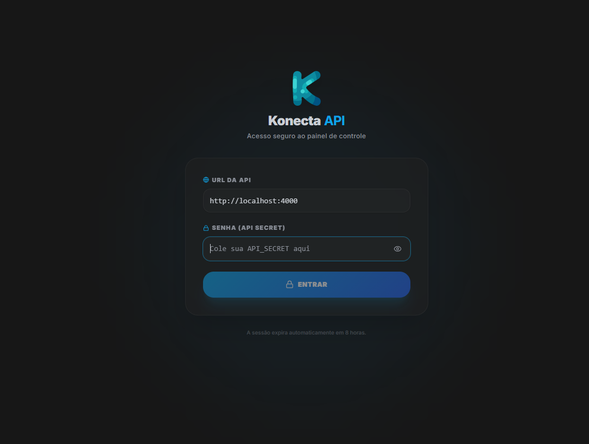

# Konecta API 🚀


A robust WhatsApp API with support for multiple instances, webhooks, message queues, and a real-time Administration Dashboard. Fully self-hosted and built on top of Baileys, Convex, Redis, and RabbitMQ.

## 🌟 Features

- **Multiple Instances:** Connect and manage several WhatsApp numbers simultaneously using *Session IDs*.
- **Modern Dashboard:** Administration interface built with React, Vite, and Tailwind CSS to manage instances, view analytics, and monitor the system.
- **Resource Monitor:** Real-time monitoring of CPU, Memory, Disk usage, and Docker container health directly from the dashboard.
- **Reliability:** Message queue powered by RabbitMQ for asynchronous sending and fault tolerance.
- **Local Database:** Uses Convex running locally (backed by PostgreSQL) for real-time synchronization of contacts, chats, messages, and webhook events.
- **Multi-Device:** Compatible with the latest WhatsApp Multi-Device version (no need to keep your phone connected to the internet).

---

## 🛠️ Usage Examples

The API uses the `API_SECRET` configured in your environment for authentication via the `X-API-Key` header.

### Send a Text Message
```bash
curl -X POST http://localhost:4000/api/v1/messages/send \
  -H "Content-Type: application/json" \
  -H "X-API-Key: your_api_secret_here" \
  -d '{
    "sessionId": "your_instance_id",
    "to": "5511999999999",
    "text": "Hello, this is a message sent by the Konecta API!"
  }'
```

### Check Instance Status
```bash
curl -X GET http://localhost:4000/api/v1/instances/your_instance_id/status \
  -H "X-API-Key: your_api_secret_here"
```

---

## 🚀 How to Initialize (Local/VPS Deployment)

Follow the steps below carefully to configure and run the project from scratch:

### 1. Create Security Tokens

Before starting, rename (or create) your `.env.local` file in the root directory and fill in the security variables.

To generate secure random strings (for `API_SECRET` and `INSTANCE_SECRET`), you can run the following in any terminal with Node.js:
```bash
node -e "console.log(require('crypto').randomBytes(32).toString('hex'))"
```

Fill in your `.env.local`:
- `API_SECRET`: (used to create instances via the API and as the login password for the Dashboard)
- `INSTANCE_SECRET`: (used for Convex database internal security)

### 2. Boot Up the Infrastructure (Dependencies)

The project depends on PostgreSQL, Redis, RabbitMQ, and the Convex Backend.
Bring up the network and dependencies first:

```bash
docker compose -f dependencias.yaml up -d --build
```
Wait a few seconds for the databases to boot up properly.

### 3. Generate the Convex Admin Key

To publish the database schema and connect the service, you'll need to generate an admin key inside the Convex container:

```bash
docker exec convex-backend ./generate_admin_key.sh
```
This will output something like: `api-local|01bff0691f9a09f2064123b33b6f5c8f68cb6098ccb85a78722d36bd1b81195a2bd7afbe68`.
**Copy this value** and place it in the `CONVEX_ADMIN_KEY` variable in your `.env.local` file.

### 4. Publish the Database Schema (Convex)

With the generated key, start the Convex development environment to create the database tables:

```bash
cd whatsapp-service

npx convex dev --url http://localhost:3210 --admin-key "Your-Key-Generated-In-Step-3-Here"
```
*(Leave it running in the background, or cancel it after it synchronizes the functions if you're not actively developing).*

### 5. Start the API and Dashboard

Finally, start the main containers (Node.js API and React Dashboard):

```bash
# Go back to the project root (if you are inside whatsapp-service)
cd ..

docker compose up -d --build
```

### 🎉 All Set!

- **Dashboard:** Access `http://localhost:5000` (Use your `API_SECRET` to log in).
- **API URL:** `http://localhost:4000`
- **Convex Dashboard (Admin DB):** `http://localhost:6791` (Password: `api-local|01bff0691f9a...` generated in step 3 via `docker exec convex-backend ./generate_admin_key.sh`).

*(If you're on a VPS, replace `localhost` with your machine's IP address in your reverse proxy/Nginx).*
